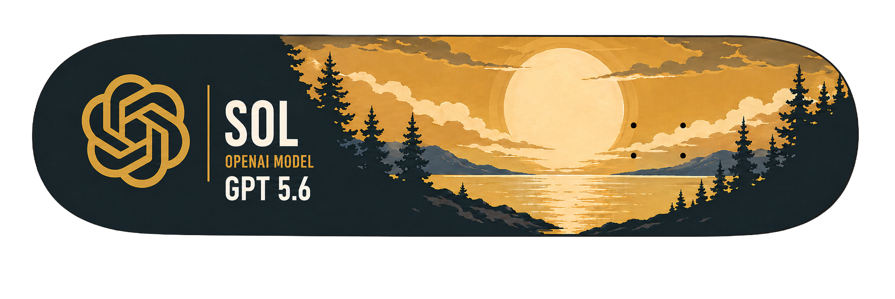
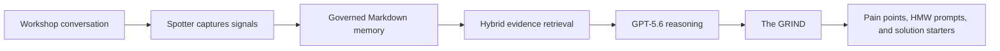
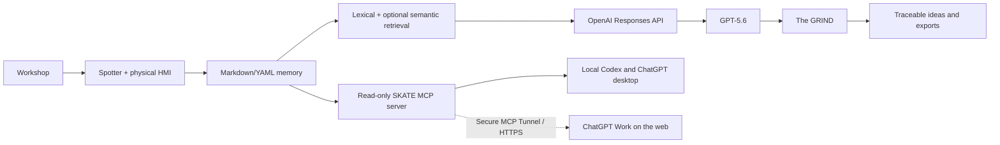
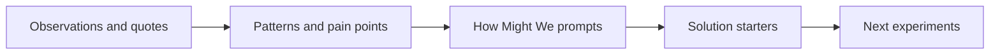
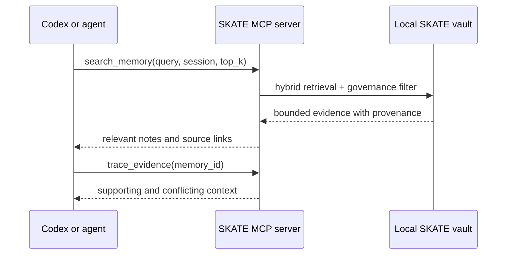

<p align="center">
  
</p>

<h1 align="center">SKATE</h1>

<h3 align="center">Local-first Workshop Memory & Design-Thinking Engine</h3>

<p align="center">
  
</p>

<p align="center">
  <strong>Built with GPT-5.6 and Codex for the OpenAI Build Week Hackathon.</strong>
</p>

<p align="center">
  Turn live conversations into governed organizational memory, retrieve only the evidence that matters, and use GPT-5.6 to generate traceable design-thinking outcomes.
</p>

<p align="center">
  
  
  
  
  
  <a href="LICENSE"></a>
</p>

<p align="center">
  <strong>OpenAI Build Week | Work &amp; Productivity</strong><br>
  Demo video: <em>public YouTube link coming before submission</em> |
  Devpost: <em>project page link coming before submission</em> |
  <a href="docs/UI-GUIDE.md">Documentation</a>
</p>

<!--
HERO GIF SLOT
1. Save the final workflow GIF as docs/images/skate-workflow.gif.
2. Replace this comment with:
   <p align="center"></p>
-->

> *You can't vibe code personality.* SKATE keeps the human judgment, context, and lived experience in the room while AI does the work of organizing evidence and turning it into action.

---

## The problem

Workshops create some of an organization's most valuable knowledge - and some of its most disposable. Observations, decisions, pain points, quotes, and unanswered questions disappear into notebooks, full meeting transcripts, and disconnected AI summaries. When a team revisits the work, it either starts over or sends an entire transcript back to a model and hopes the important evidence is still visible.

## The solution

**SKATE is a workshop operating system, not another note-taking app.** It captures natural meeting notes, preserves important signals as typed and linked memory, retrieves a bounded evidence set for AI agents, and uses GPT-5.6 to turn that evidence into a traceable design-thinking synthesis.



<!-- FULL-WORKFLOW GIF SLOT: place the strongest end-to-end demo immediately below the diagram. -->

## What works today

| Capability | Status |
|---|---|
| Local-first Markdown/YAML memory with typed relationships | Working |
| Spotter and Spotter Live workshop capture | Working |
| Local Whisper and optional ElevenLabs speech-to-text | Working |
| 2D/3D knowledge graph and Excel export | Working |
| GPT-5.6-powered GRIND synthesis through the OpenAI Responses API | Working |
| Read-only MCP server for local Codex and ChatGPT desktop clients | Working |
| Secure MCP Tunnel / hosted ChatGPT Work connection and recorded demo | **Working; included in releases** |
| Inno Setup installer with bundled `SKATE-MCP.exe` | **Working; included in releases** |

The release supports both local MCP access and the hosted ChatGPT Work connection. The Windows installer includes the SKATE application and bundled MCP executable for a ready-to-run release experience.

## Six core capabilities

- **Governed local memory** - human-readable Markdown with YAML metadata, active/inactive governance, themes, provenance, and typed relationships such as `supports`, `contradicts`, `causes`, `leads_to`, and `references`.
- **Meaningful GPT-5.6 reasoning** - GRIND is explicitly pinned to GPT-5.6 with high reasoning effort for cross-note evidence synthesis, while Spotter uses a faster GPT-5.6 configuration for live facilitation.
- **Evidence-backed retrieval** - weighted lexical search plus optional local semantic embeddings retrieves a small, relevant evidence set instead of repeatedly loading a complete vault or transcript.
- **Spotter and Spotter Live** - capture manual notes, transcribe recordings locally, listen to a room, or use ElevenLabs Scribe for realtime speaker labels.
- **The GRIND** - explore memory as a 2D/3D graph, identify patterns across a session, generate IDEO-style outputs, trace results to source notes, and export the full ranked synthesis to Excel.
- **A physical workshop interface** - an Elgato Stream Deck Neo and a custom skateboard-wheel microphone puck give the agent a practical human-machine interface in the room.

## Why SKATE is different

| Traditional AI notes | SKATE |
|---|---|
| Produces a meeting summary | Builds governed organizational memory |
| Sends a full transcript as context | Retrieves a bounded set of relevant evidence |
| Stores flat pages or informal backlinks | Maintains typed evidence and causal relationships |
| Centers a chat box | Operates as a workshop capture and synthesis system |
| Applies generic summarization | Follows a design-thinking path from evidence to action |
| Hides the source of an answer | Links outputs back to inspectable source notes |
| Ends with prose | Produces ranked pain points, How-Might-We prompts, solution starters, and Excel outputs |

Obsidian is an excellent personal knowledge workspace. SKATE addresses a different job: helping facilitators and project teams convert a live, multi-person workshop into governed, reusable evidence and then deliberately synthesize that evidence into improvement opportunities.

## Architecture



The local vault remains the source of truth. Search indexes and embeddings are rebuildable acceleration layers, not proprietary memory. Cloud services are explicit and optional except when the user requests their capabilities.

## Why GPT-5.6

The central AI task in SKATE is not "summarize this meeting." It is a constrained, evidence-heavy reasoning problem across multiple notes: recognize recurring tensions, distinguish observations from proposed solutions, preserve source traceability, reframe problems without embedding a preferred answer, and generate concrete starting points for experimentation.

GPT-5.6 is used where that reasoning quality matters most:

1. **GRIND synthesis** reads the active evidence in a selected session.
2. **Pattern detection** identifies repeated pains, unmet needs, risks, and contradictions.
3. **Design-thinking reframing** creates divergent How-Might-We prompts.
4. **Solution synthesis** proposes concrete, evidence-linked solution starters.
5. **Spotter coaching** uses session memory to assist a facilitator during the workshop.

The implementation is deliberately visible in [`ui/app.py`](ui/app.py):

- `_grind_gpt56_settings()` fixes GRIND to `gpt-5.6` with high reasoning effort.
- `_grind_insights()` sends the structured synthesis request through the OpenAI Responses API.
- Spotter defaults to the GPT-5.6 family with a lower-latency reasoning setting for live interaction.
- OpenRouter and local chat-model routing are intentionally excluded from this hackathon build, making the GPT-5.6 evaluation path unambiguous.

## The GRIND: synthesis, not summarization

GRIND stands for the part of SKATE where workshop memory becomes forward motion. It reads the signals people captured in the room and follows a design-thinking progression:



GRIND respects note and session governance: inactive notes are retained in the vault but excluded from analysis, and inactive sessions do not appear as GRIND targets. Its outputs are useful because they remain connected to evidence:

- **Pain Points** describe what is broken or difficult for people, based on repeated signals.
- **How Might We prompts** open the problem space without prescribing a solution.
- **Solution Starters** turn evidence into specific moves a team can evaluate or prototype.
- **Open** returns the reviewer to the originating note.
- **Export IDEO Excel** provides the complete ranked output for a workshop readout or backlog.

The 2D and 3D views make the same memory inspectable as a network of notes, themes, and typed rails. The graph is not the memory system itself; it is a lens for seeing relationships that are difficult to notice in a folder of documents.

## MCP: the agent-memory interface

> **Implementation status:** the read-only MCP server is implemented and protocol-tested over both STDIO and Streamable HTTP. Local Codex and hosted ChatGPT Work connections are working and included in releases.

SKATE's MCP server lets Codex and other MCP-enabled agents ask for the smallest useful slice of workshop memory rather than receiving an entire meeting transcript. MCP is the interface; SKATE's governed Markdown, relationships, retrieval, and provenance remain the memory architecture behind it.



Available tools:

| Tool | Purpose |
|---|---|
| `list_active_sessions` | Show the workshop memories available to an agent |
| `search_memory` | Return a small ranked evidence set for a query |
| `get_memory_object` | Read one complete governed memory object |
| `get_session_context` | Retrieve a bounded overview of one session |
| `trace_evidence` | Follow provenance and typed relationships |
| `get_grind_outputs` | Retrieve the most recent design-thinking synthesis |
| `search` / `fetch` | Compatibility tools for ChatGPT knowledge and research surfaces |

This architecture reduces repeated context because agents retrieve Top-K evidence instead of whole transcripts. On the committed demo vault, the test query `families repeat their story` returned three evidence excerpts estimated at 378 tokens instead of approximately 4,337 tokens for all eligible notes, an estimated 91.3% context reduction for that query. This is a query-level estimate, not a universal savings claim.

Connection instructions, privacy boundaries, demo prompts, and the ChatGPT Work tunnel path are documented in [`docs/MCP-CONNECTION.md`](docs/MCP-CONNECTION.md).

## Spotter: an AI workshop agent with an HMI

<p align="center">
  
</p>

### Why the name “Spotter”?

In skateboarding, the person attempting the trick is not entirely alone. A **spotter** watches the surrounding environment, looks out for approaching hazards, helps determine when the path is clear, and supports the skater without taking over the attempt. The role is an alert, trusted safety net operating just outside the spotlight. [SurferToday describes the underrated role of the skate spotter](https://www.surfertoday.com/skateboarding/the-underrated-role-of-the-skate-spotter).

SKATE's Spotter serves the same purpose in a workshop. The facilitator still leads the room and makes the judgment calls; Spotter listens at the edge of the session, preserves important signals, identifies risks and gaps, and helps the team move forward without replacing the human leading the work.

Spotter is the facilitation copilot. It helps capture pains, observations, questions, actions, solutions, recommendations, and insights without forcing the facilitator to disengage from the room. Spotter Live can maintain a timestamped transcript; local Whisper keeps audio processing on the machine, while optional ElevenLabs Scribe Realtime adds speaker diarization such as Speaker 1 and Speaker 2.

### Stream Deck Neo control surface

<p align="center">
  
</p>

The Stream Deck turns facilitation methods into one-press stances: Observe, Find Waste, 5 Whys, How Might We, Frame, Test, Start, and Stop. The facilitator can change the agent's mode without breaking eye contact or navigating a menu. Custom icons and the hotkey map are in [`streamdeck-neo-icons/`](streamdeck-neo-icons/).

### Skate-wheel microphone puck

<p align="center">
  
</p>

The custom 3D-printed skateboard-wheel housing holds a conference microphone array at the center of the table. It gives the otherwise invisible agent a memorable, understandable place in the workshop. Build files and the hardware guide are in [`hardware-spotter-mic-puck/`](hardware-spotter-mic-puck/).

<!--
PRODUCT SCREENSHOT GALLERY - ADD BEFORE SUBMISSION
Recommended order (six to eight images maximum):
1. Library/dashboard
2. A realistic meeting note with colored #O, #P, #Q, and #A signals
3. Spotter
4. Spotter Live with ElevenLabs speaker labels
5. 2D or 3D GRIND graph
6. GRIND pain / HMW / solution outputs with source links
7. Stream Deck + microphone puck in use
8. Excel export or MCP evidence-retrieval demo
-->

## Demo scenario: Harborlight

The repository includes **fictional nonprofit workshop material** for Harborlight. It demonstrates the product without exposing client or personal data.

A judge can follow this story:

1. Open a Harborlight workshop session and review realistic, human-style meeting notes.
2. Notice plain text mixed with compact capture signals such as `#O` observation, `#P` pain, `#Q` question, and `#A` action.
3. Use Spotter or Spotter Live to add workshop evidence.
4. Inspect the session in the 2D or 3D knowledge graph.
5. Select the active session and click **Start the GRIND**.
6. Review pain points, How-Might-We prompts, and solution starters.
7. Use **Open** to trace an output back to its source note.
8. Export the complete ranked synthesis to Excel.

## Run SKATE

### Fastest path on Windows

**Requirements:** Windows and Python **3.10-3.13**. During Python installation, select **Add Python to PATH**.

```powershell
git clone https://github.com/SixSigmaEngineer/SKATE.git
cd SKATE
```

Then double-click **`Start SKATE.bat`**. On first run it creates a private `.venv`, installs the required packages, starts the local service, and opens the SKATE native app window. Use **`Stop SKATE.bat`** to stop the local service.

Open **Settings** and add an OpenAI API key to use GPT-5.6 features. An ElevenLabs key is optional. For fully local transcription, run **`Install Local Whisper.bat`** once and restart SKATE.

### Manual development run

```powershell
py -3.13 -m venv .venv
.venv\Scripts\python -m pip install -r ui\requirements.txt
.venv\Scripts\python ui\app.py
```

The local service binds to `127.0.0.1:8765`. Add `--reload` for development or `--browser` only when you intentionally want the browser version.

### Optional services

| Capability | Requirement |
|---|---|
| GPT-5.6 GRIND and Spotter reasoning | OpenAI API key |
| Local audio/video transcription | Local Whisper installation |
| Realtime transcript with speaker diarization | ElevenLabs API key and Scribe Realtime |
| Local semantic retrieval | FastEmbed or Ollama with `nomic-embed-text` |
| Basic retrieval and manual notes | No cloud service required |

## Privacy and governance

- Notes, sessions, and transcripts are stored as local files under the SKATE project or vault.
- Markdown and YAML are readable without SKATE and can be versioned, backed up, moved, or inspected with ordinary tools.
- Local Whisper can transcribe recordings without uploading the media to a cloud speech provider.
- Optional semantic embeddings can run locally and are cached by content hash.
- The server binds to `127.0.0.1`, not a public network interface by default.
- `settings.json`, private conversations, transcripts, logs, and local model artifacts are excluded through `.gitignore`.
- Content leaves the computer only when the user invokes a configured cloud capability such as OpenAI reasoning or ElevenLabs speech.
- Active/inactive status controls whether a note or session participates in GRIND analysis.

## Technology stack

| Layer | Technology |
|---|---|
| Application | Python, FastAPI, Jinja2, pywebview |
| AI reasoning | OpenAI GPT-5.6 via the Responses API |
| Memory | Markdown, YAML frontmatter, typed relationships |
| Retrieval | Weighted lexical scoring, optional FastEmbed or Ollama embeddings |
| Speech | Local Whisper; optional ElevenLabs Scribe and text-to-speech |
| Visualization | Custom 2D/3D WebGL knowledge graph |
| Export | Excel workshop synthesis |
| Physical HMI | Elgato Stream Deck Neo and custom microphone housing |
| Agent access | Official MCP Python SDK; STDIO and Streamable HTTP |

## Repository map

```text
SKATE/
|-- ui/                         application, routes, templates, and static assets
|-- conversations/              local Markdown memory objects
|-- sessions/                   session governance and metadata
|-- transcripts/                Spotter Live Markdown transcripts
|-- demo-vault/                 fictional Harborlight demonstration material
|-- workshop-knowledge-documents/ facilitation and methodology corpus
|-- streamdeck-neo-icons/       physical-control icons and hotkey map
|-- hardware-spotter-mic-puck/  microphone enclosure files and build guide
|-- mcp_server/                 governed MCP tools and transports
|-- tests/                      automated test suite
|-- tools/                      project utilities
|-- Start SKATE.bat             one-click Windows launcher
|-- Stop SKATE.bat              local-service stop command
|-- TECH_STACK.md               deeper implementation notes
`-- LICENSE                     MIT license
```

## Roadmap to the final submission

- [x] Connect the tested server through Secure MCP Tunnel and record a Codex/ChatGPT retrieval-and-provenance demo.
- [ ] Benchmark retrieval quality, context size, latency, and token reduction against full-transcript prompting.
- [ ] Add an experiment canvas that carries GRIND solution starters into desirability, feasibility, viability, and measurable tests.
- [x] Compile and fresh-machine-test the Inno Setup installer and system-tray experience.

## Built with GPT-5.6 and Codex

SKATE is an output of the **OpenAI Build Week Challenge** and is submitted in **Work & Productivity**.

- **Human-directed product design:** the problem framing, facilitation philosophy, memory architecture, physical interface, and product decisions were directed by the project creator.
- **Codex-accelerated implementation:** Codex helped turn those decisions into working software, debug cross-cutting flows, create tests, refine the native app experience, and maintain the technical and submission documentation.
- **GPT-5.6 at runtime:** GPT-5.6 performs the project's central reasoning task - the GRIND's evidence-linked design-thinking synthesis - and supports the live Spotter facilitation experience.

This separation is important: Codex accelerated the build, GPT-5.6 powers the product, and the creator supplied the judgment, domain experience, and personality that make SKATE specific.

## License

SKATE is available under the [MIT License](LICENSE). Hardware components and third-party services remain subject to their respective licenses and terms.

---

**SKATE turns conversations into memory, memory into evidence, and evidence into better ideas.**
